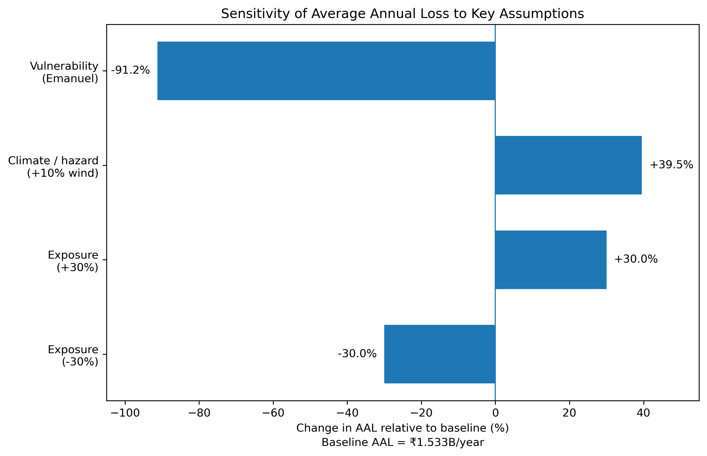
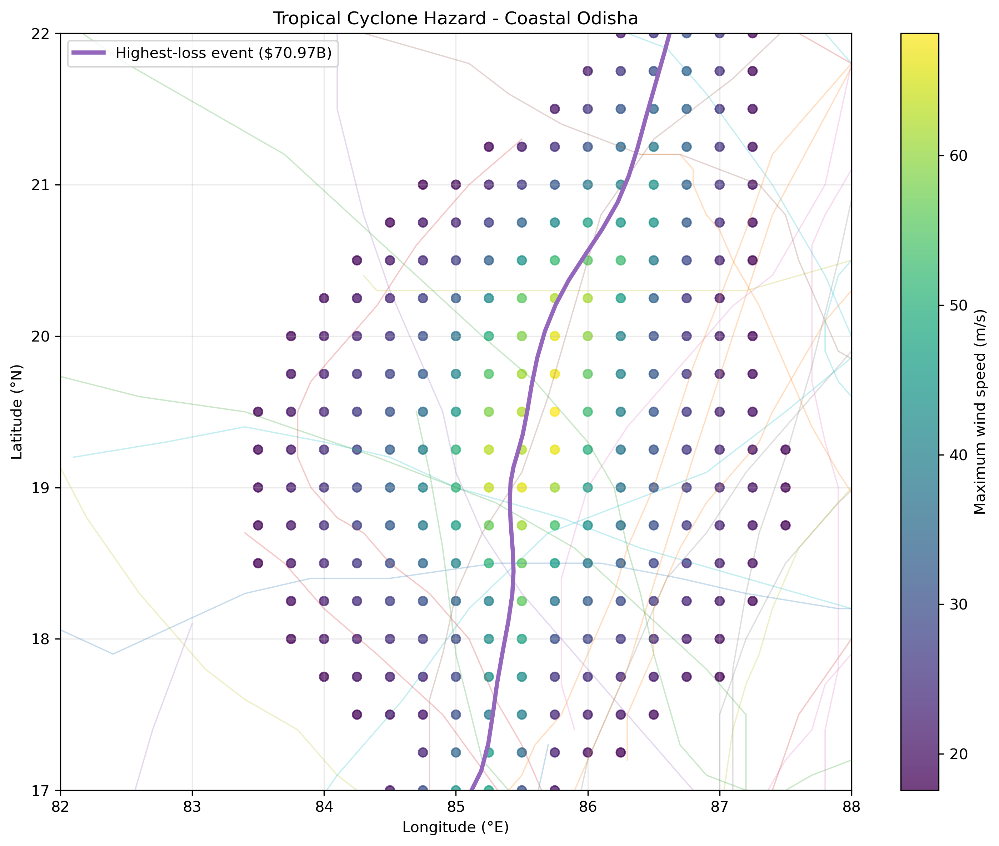
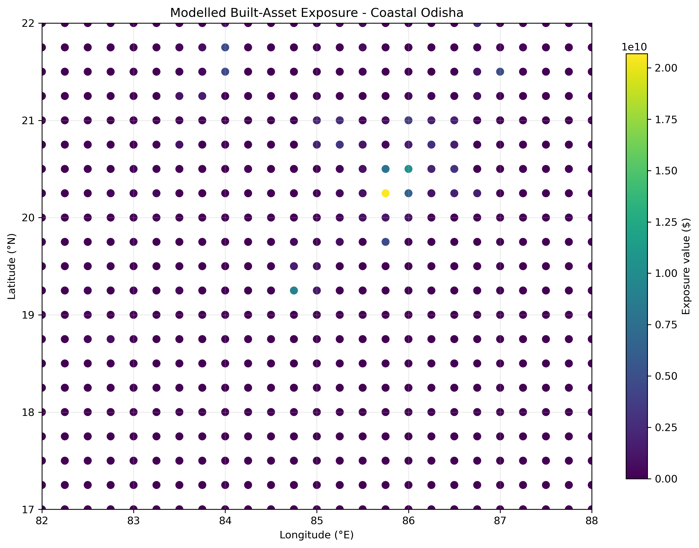
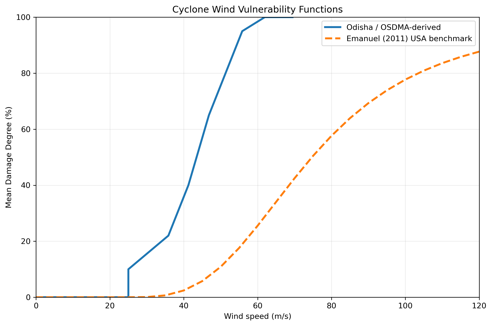
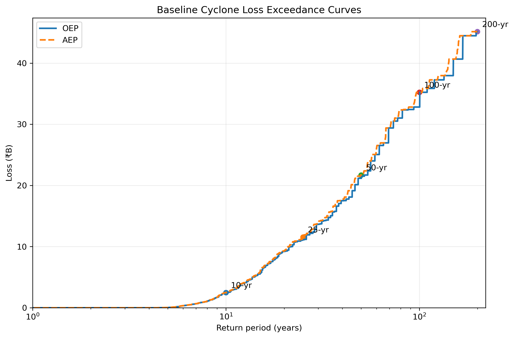
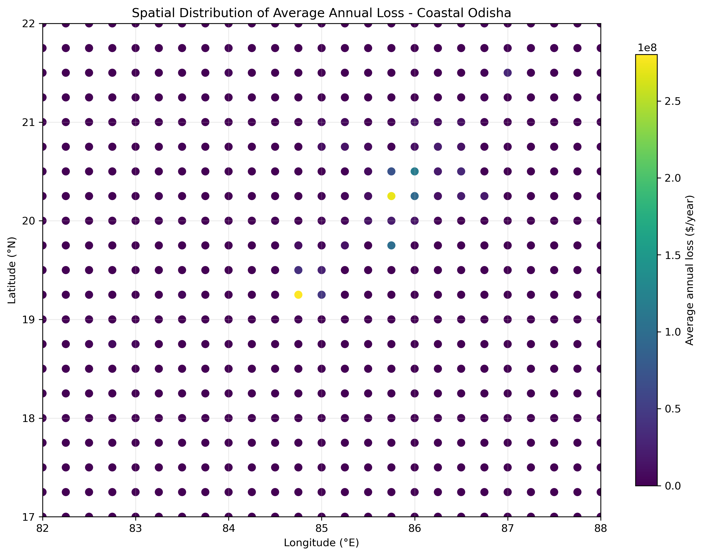
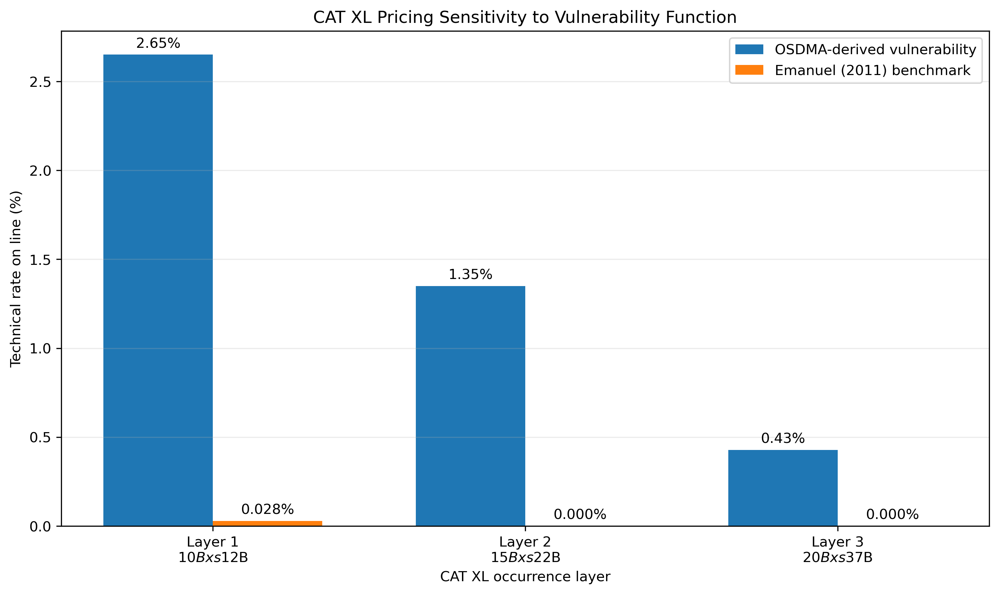

# Climate-Conditioned Tropical Cyclone Risk - Coastal Odisha Belt

An end-to-end catastrophe risk model for Bay of Bengal tropical cyclones over the coastal
Odisha belt (17-22°N, 82-88°E), covering the full `hazard × exposure × vulnerability → loss`
chain, extended to climate conditioning, uncertainty analysis, and reinsurance layer pricing.

**Stack:** Python · CLIMADA · IBTrACS · LitPop · GeoPandas · NumPy/SciPy · Matplotlib

---

## Headline finding

> For coastal Odisha cyclone risk, **vulnerability specification** rather than hazard modelling alone is the dominant uncertainty identified in this analysis.
> The Odisha-derived vulnerability function produces an average annual loss approximately **11.4× higher** than the Emanuel (2011) US-calibrated benchmark under the same hazard and exposure. 
> This sensitivity is substantially larger than the approximately 40% AAL increase from the illustrative +10% wind-intensity scenario and the approximately proportional response to ±30% exposure changes. 
> The result highlights vulnerability calibration as the key priority for improving the reliability of loss and reinsurance estimates.

---

## Results at a glance

| Metric | Value | Notes |
|---|---|---|
| Total modelled exposure | ₹144.86B | LitPop-derived, built-asset proxy |
| Average Annual Loss (AAL) | ₹1.533B / yr | Odisha-derived vulnerability curve |
| AAL as % of exposure | 1.06% | Wind peril only |
| 100-year OEP | ₹32.81B | Supported by ~12 catalogue events ⚠ |
| 100-year AEP | ₹35.22B | From 100,000-year simulated Year Loss Table |
| 100-year TVaR | ₹47.49B | Mean annual loss conditional on exceeding the 1-in-100 AEP threshold |
| CAT XL Layer 1 (₹10B xs ₹12B) | 2.65% RoL | Technical rate on line |

⚠ = estimate carries substantial sampling uncertainty; see [Limitations](#known-limitations).

---

## The uncertainty hierarchy

Ranked by importance to the reliability and interpretation of modelled loss:

| Rank | Driver | Effect on AAL | Comment |
|---|---|---|---|
| 1 | **Vulnerability specification** | ~11.4× spread | Emanuel (US-calibrated) vs OSDMA-derived Odisha curve |
| 2 | **Hazard intensity / climate** | +10% wind → +40% AAL | Strong non-linearity in damage response |
| 3 | **Exposure valuation** | ±30% → ±30% AAL | Approximately linear pass-through |
| 4 | **Tail sampling** | Increasing at RP ≥ 100 | 100-year estimate rests on ~12 events; 200-year on ~6 |
| 5 | **EVT extrapolation** | Not used | No stable GPD regime found: see below |



**Note:** Percentage changes are relative to the baseline Odisha-derived vulnerability model. The Emanuel (2011) benchmark produces an AAL approximately 91.2% lower than baseline (equivalently, the baseline AAL is approximately 11.4× the Emanuel result).

---

## Method

### 1. Hazard

- **Source:** IBTrACS North Indian Ocean basin → 146 usable historical storms
- **Screening:** broad Bay of Bengal box → 54 candidate storms affecting the study domain
- **Stochastic expansion:** 50 perturbed trajectories per historical track, retaining the original tracks as well → 2,754 synthetic events, with **total cyclone-event frequency preserved at 2.16 events/yr** across the expansion
- **Grid:** 525 centroids at 0.25° over 17-22°N, 82-88°E
- **Distance-to-coast:** computed independently via WGS84 geodesic distances after the NASA dataset dependency returned HTTP 403 (see [What I rejected](#what-i-rejected-and-why))
- **Wind field:** CLIMADA `TropCyclone`, producing a 2,754 × 525 intensity matrix



*Figure 1. Historical candidate tracks with the highest-loss stochastic event highlighted; coloured points show maximum modelled wind intensity across the 525-cell hazard grid.*

### 2. Exposure

- **Source:** LitPop (nightlights × population), clipped to the study grid
- **Total exposed value:** ₹144.86B
- **Alignment:** generated on the identical 525-cell grid to guarantee hazard–exposure correspondence by construction



*Figure 2. LitPop-derived built-asset exposure across the 525-cell coastal Odisha study grid; total modelled exposure is ₹144.86B.*

### 3. Vulnerability

- **Primary curve:** derived from OSDMA-documented coastal Odisha building damage data
- **Comparison curve:** Emanuel (2011) USA-calibrated function, retained as the sensitivity benchmark
- **Rationale:** the locally derived curve was preferred for the baseline because the analysis is focused on coastal Odisha; the Emanuel function was retained to quantify vulnerability uncertainty (see [What I rejected](#what-i-rejected-and-why))



*Figure 3. Odisha/OSDMA-derived and Emanuel (2011) USA-calibrated wind vulnerability functions used in the analysis. The comparison illustrates the sensitivity of modelled loss to vulnerability specification.*

### 4. Loss

- Full loss matrix: 2,754 events × 525 centroids

**Two distinct frequencies are used in this analysis and should not be conflated:**

| Quantity | Value | Meaning |
|---|---|---|
| Total cyclone-event frequency | 2.16 /yr | All synthetic events affecting the domain, including those producing zero modelled loss |
| **Loss-producing** event frequency | 0.262 /yr | Only the 334 events generating non-zero loss on the modelled exposure |

The Year Loss Table is built on the **loss-producing** rate, since events causing no modelled
loss do not contribute to the annual aggregate distribution.

- **Year Loss Table:** 100,000 synthetic years generated by sampling event counts from Poisson(λ = 0.262 loss-producing events/yr) and sampling individual events in proportion to their individual frequencies, with replacement
- Metrics derived: AAL, OEP, AEP, TVaR, spatial AAL decomposition, event-level loss attribution



*Figure 4. Empirical occurrence (OEP) and aggregate (AEP) loss exceedance curves from the 100,000-year simulated Year Loss Table. The two curves remain close because loss-producing events occur at a low rate (~0.26/year), so most loss-producing years contain a single event. Tail estimates beyond 1-in-50 years remain sampling-sensitive.*



*Figure 5. Spatial distribution of modelled average annual loss across the 525-cell study grid. Loss is concentrated in a relatively small portion of the domain, reflecting the interaction of cyclone wind intensity, exposure, and vulnerability.*

### 5. Climate conditioning

- **Scenario applied:** illustrative +10% scaling of cyclone wind intensity, with event frequencies, exposure, and vulnerability held constant 
- Result: +10% wind intensity → ~39.6% AAL increase, reflecting the non-linear response of the vulnerability function

### 6. Reinsurance structure

- Layer tower defined with attachment anchored near the 1-in-25 empirical OEP
- CAT XL treated as an occurrence cover, with recovery calculated separately for each event
- Reported per layer: expected loss to layer, technical rate on line, attachment and exhaustion probabilities



*Figure 6. Technical rate-on-line for the CAT XL tower under the primary Odisha/OSDMA-derived vulnerability function and the Emanuel (2011) benchmark. The large reduction in layer burn under the benchmark illustrates how vulnerability uncertainty propagates directly into reinsurance pricing.*

---

## Validation and checks performed

**Hazard**

- Maximum modelled wind **69.24 m/s** - within the range of severe tropical cyclone intensities represented in the North Indian Ocean basin.

- **Cyclone Fani spatial back-test:** the modelled maximum-intensity location (**17.75°N, 85.0°E**) agrees with the IBTrACS maximum-intensity position (**17.6°N, 84.8°E**) to within approximately **27 km**, supporting the alignment of track processing, wind-field generation, and the centroid grid.

- **Wind magnitude comparison (treated separately):** the modelled Fani peak is **68.05 m/s**, while the IBTrACS USA track reports a maximum sustained wind of **150 kn (~77.2 m/s)** at the storm's peak-intensity position. Because the two wind estimates may use different averaging and wind-field conventions, this comparison is treated as an **order-of-magnitude plausibility check rather than a numerical validation**.

- **Sparsity check:** 92.9% of event–centroid pairs are zero, as expected for a peril where most storms do not affect most locations.

- **Footprint inspection:** coherent cyclone structure, with a compact high-wind core and outward decay.

- **Frequency preservation:** verified across the stochastic perturbation expansion.

**Loss**

- **Fani loss back-test:** modelled wind loss **₹46.91B** versus **₹93.36B** reported economic loss.
  - The difference is consistent with the model's wind-only scope and proxy exposure base, but this is a **directional back-test, not a calibration target**. The reported figure also includes asset classes and loss types outside the model's scope, so the shortfall cannot be attributed specifically to storm surge or flooding on the basis of this single comparison.

- **Tail support quantified explicitly:** **127 / 51 / 25 / 12 / 6** events support the 10 / 25 / 50 / 100 / 200-year estimates respectively. Estimates become increasingly sampling-sensitive beyond 1-in-50 years; the empirical 1-in-100 and 1-in-200 estimates rest on approximately **12 and 6 catalogue events**, respectively.

- **Split-half stability test:** the 100-year estimate showed **substantial instability**, which is reported as a limitation of the empirical tail estimate.

---

## What I rejected, and why

**GPD tail extrapolation - rejected.** Mean residual life and parameter stability diagnostics showed the shape parameter drifting increasingly negative at higher thresholds rather than stabilising, indicating no stable extreme-value regime. The negative shape is consistent with a model-imposed loss ceiling arising from finite exposure, a saturating damage function, and a catalogue derived from 54 historical tracks, rather than representing a genuine physical bound on cyclone loss. Fitting a GPD regardless would have produced a smooth, authoritative-looking tail that was not supported by the data. Empirical estimates were retained instead, with sampling uncertainty stated explicitly.

**Emanuel (2011) as the primary vulnerability curve - rejected.** Calibrated on US building stock with a 25.7 m/s damage threshold and 74.7 m/s half-damage point, the function was developed for US conditions. Applying it unexamined to Indian coastal construction would introduce a systematic mismatch of *unknown direction* - not, as is sometimes assumed, necessarily an under-estimate. It was therefore retained as a comparison curve to quantify vulnerability uncertainty.

**NASA distance-to-coast dataset - bypassed.** The CLIMADA dependency returned HTTP 403. Rather than blocking the pipeline, distance-to-coast was computed independently using WGS84 geodesic distances to Natural Earth coastlines, making the workflow reproducible without the external dependency.

**Full-state Odisha domain rejected in favour of the coastal belt.** Tropical cyclone wind hazard decays rapidly after landfall, so inland areas contribute little to the modelled wind loss while diluting loss metrics and adding computational cost. The domain is therefore scoped to the coastal belt where wind hazard is materially concentrated, and is named as such throughout.

---

## Known limitations

- **Wind peril only.** Storm surge and rainfall-driven flooding are excluded, despite being major loss contributors for Odisha cyclones (Phailin, Fani, Yaas). This is the single largest scope limitation and likely explains a substantial part of the Fani back-test gap.

- **Exposure is a proxy.** LitPop estimates built-asset value from nightlights and population. It may under-represent informal coastal settlements (low light output, potentially high vulnerability) and excludes agricultural and fishing-sector assets, both material in this region.

- **Economic, not insured, loss.** Outputs represent modelled economic loss. The gap between economic and insured loss is the protection gap and is not quantified here.

- **Vulnerability curve applied unstratified.** The OSDMA-derived curve distinguishes construction types, but no spatial building-type inventory was available, so a single blended curve was applied. This discards much of the curve's regional advantage.

- **Vulnerability curve vintage.** Post-Phailin and post-Fani improvements in coastal construction standards are unlikely to be fully reflected.

- **Tail estimates become increasingly sampling-sensitive beyond 1-in-50 years.** The empirical 1-in-100 and 1-in-200 estimates are supported by approximately 12 and 6 catalogue events respectively and should be treated as indicative.

- **Catalogue ceiling.** Synthetic events derive from 54 historical tracks; the modelled maximum possible loss is bounded by construction and does not represent a physical bound on cyclone loss.

---

## Repository structure

```
odisha-cyclone-risk/

├── notebooks/
│   ├── 01_hazard.ipynb       # cyclone tracks, stochastic perturbation, wind fields, validation
│   ├── 02_exposure.ipynb     # LitPop exposure generation and spatial QA
│   └── 03_impact.ipynb       # vulnerability, loss modelling, YLT, EVT, sensitivity and reinsurance
│
├── data/                     # raw and intermediate data
├── outputs/
│   └── figures/              # analysis figures used in the README
│
└── RISK_BRIEF.md             # one-page non-technical risk summary

```
---

## Reproducing

```bash
conda env create -f environment.yml
conda activate climada_env
jupyter lab
```

Run notebooks in numerical order. The notebooks are designed to be run sequentially, with outputs from earlier stages used by downstream analyses.

Data: The data/ directory is not included in the repository because it contains large external datasets. Before running the notebooks, obtain the required IBTrACS, LitPop, and GPW population datasets and place them under data/ as described in the notebook setup cells.

---

## Data sources

| Dataset | Source | Use |
|---|---|---|
| IBTrACS v4 | NOAA National Centers for Environmental Information (NCEI) | Historical tropical cyclone tracks |
| LitPop | CLIMADA / ETH Zürich | Gridded built-asset exposure proxy |
| Natural Earth coastlines | Natural Earth | Geodesic distance-to-coast calculation |
| OSDMA damage data | Odisha State Disaster Management Authority / World Bank study | Odisha-specific vulnerability curve |

---

## Future work

- **Multi-peril extension:** add storm surge and rainfall/inland flooding modules.
- **Stratified vulnerability:** assign construction-specific damage functions using a building-type inventory rather than a single blended curve.
- **Insured-loss conversion:** replace LitPop economic exposure with insured values and policy terms to translate economic loss into portfolio loss.

---

## References

1. Aznar-Siguan, G. & Bresch, D. N. (2019). *CLIMADA v1: a global weather and climate risk assessment platform.* Geoscientific Model Development, 12, 3085–3097. https://doi.org/10.5194/gmd-12-3085-2019

2. Emanuel, K. (2011). *Global warming effects on U.S. hurricane damage.* Weather, Climate, and Society, 3, 261–268. https://doi.org/10.1175/WCAS-D-11-00007.1

3. Eberenz, S., Stocker, D., Röösli, T., & Bresch, D. N. (2020). *Asset exposure data for global physical risk assessment.* Earth System Science Data, 12, 817–833. https://doi.org/10.5194/essd-12-817-2020

4. Knapp, K. R., Kruk, M. C., Levinson, D. H., Diamond, H. J., & Neumann, C. J. (2010). *The International Best Track Archive for Climate Stewardship (IBTrACS): Unifying tropical cyclone best track data.* Bulletin of the American Meteorological Society, 91, 363–376. https://doi.org/10.1175/2009BAMS2755.1

5. World Bank. (2010). *Project Appraisal Document on a Proposed Credit in the Amount of SDR 164.10 Million (US$255 Million Equivalent) to the Republic of India for a National Cyclone Risk Mitigation Project (I), in Support of the First Phase (APL-1) of the National Cyclone Risk Mitigation Program.* Report No. 52304-IN.

6. Coles, S. (2001). *An Introduction to Statistical Modeling of Extreme Values.* Springer.

---

## Author

**Navneet Krishnan**  
M.Sc. Atmospheric Sciences · National Institute of Technology Rourkela  
[LinkedIn](https://www.linkedin.com/in/navneet-krishnan2004) · [Email](mailto:krishnan.navneet2004@gmail.com)
